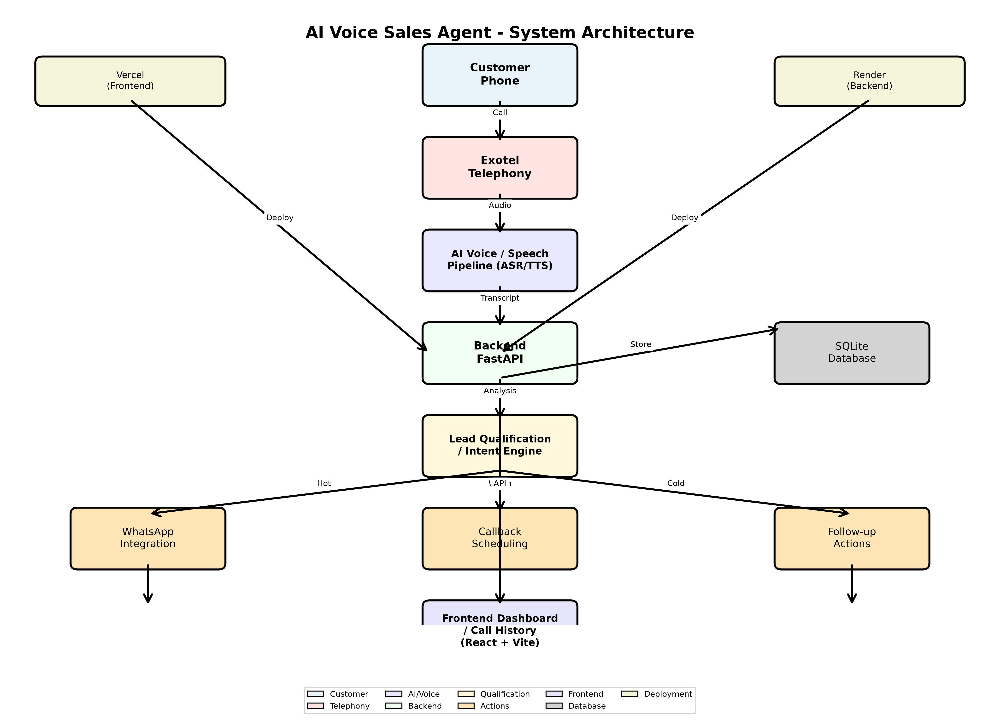

# AI Voice Sales Agent - Architecture Documentation

## System Architecture Overview

The AI Voice Sales Agent is a full-stack telephony application that automates outbound sales calls, qualifies leads using AI, and manages follow-up actions through multiple channels.

## Architecture Diagram

## System Flow

1. **Customer Phone** - Incoming customer calls are received
2. **Exotel Telephony** - Handles call routing and telephony infrastructure
3. **AI Voice / Speech Pipeline** - Processes audio through ASR (Automatic Speech Recognition) and TTS (Text-to-Speech)
4. **Backend FastAPI** - Python backend that orchestrates the entire system
5. **Lead Qualification / Intent Engine** - Analyzes conversation to qualify leads as Hot/Warm/Cold
6. **Action Routing** - Based on qualification:
   - **Hot** → WhatsApp integration for immediate engagement
   - **Warm** → Callback scheduling for follow-up calls
   - **Cold** → Follow-up actions for nurturing
7. **Frontend Dashboard** - React + Vite dashboard for call history and management

## Technology Stack

### Frontend
- **React** - UI framework
- **Vite** - Build tool and dev server
- **TypeScript** - Type-safe JavaScript
- **TailwindCSS** - Styling
- **Deployment**: Vercel

### Backend
- **FastAPI** - Python web framework
- **SQLite** - Database for call records and callbacks
- **Pydantic** - Data validation
- **Deployment**: Render (Singapore region)

### Telephony & AI
- **Exotel** - Telephony provider (India region)
- **OpenAI GPT-4o-mini** - AI model for conversation and qualification
- **Voice Pipeline** - ASR/TTS for speech processing

### Integrations
- **Twilio WhatsApp** - WhatsApp messaging
- **Exotel Webhooks** - Call status and transcript callbacks

## Key Components

### Backend Services
- `exotel.py` - Exotel API integration for calls
- `voice_agent.py` - AI conversation handling
- `qualification.py` - Lead scoring and intent analysis
- `whatsapp.py` - WhatsApp messaging via Twilio
- `callback.py` - Callback scheduling and management

### API Endpoints
- `/api/calls/start` - Initiate outbound call
- `/api/calls/{call_id}` - Get call details
- `/api/calls/{call_id}/qualification` - Get lead qualification
- `/api/calls/{call_id}/callback` - Schedule callback
- `/api/webhooks/exotel/*` - Exotel webhook handlers
- `/health` - Health check endpoint

### Database Schema
- Calls - Call records with transcripts
- Callbacks - Scheduled callbacks
- Qualifications - Lead qualification results

## Deployment

### Frontend (Vercel)
- Automatic deployments from GitHub
- SPA routing configured
- Environment variables for API endpoints

### Backend (Render)
- Python 3.14 runtime
- PostgreSQL database
- Auto-deploys from GitHub
- Environment variables for Exotel credentials

## Security Considerations

- All API credentials stored in environment variables
- CORS configured for frontend-backend communication
- Webhook signature verification for Exotel callbacks
- No hardcoded secrets in codebase

## Monitoring & Diagnostics

- Health check endpoint at `/health`
- Diagnostic endpoints for Exotel credential verification
- Comprehensive logging for debugging
- Error handling with appropriate HTTP status codes
